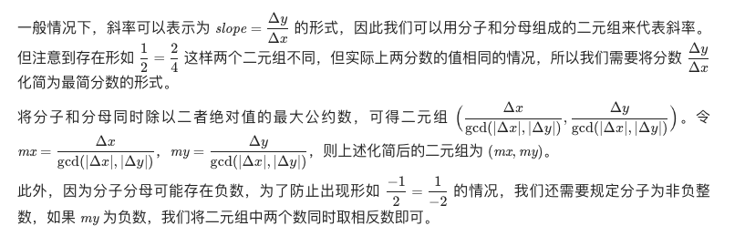
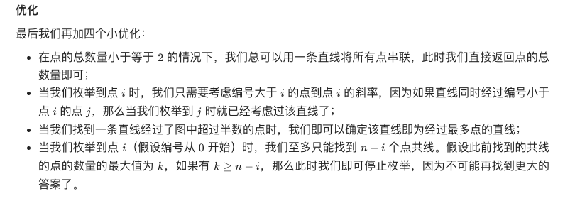
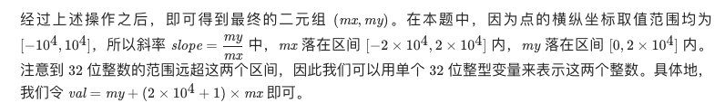

###   直线经过点最多

#### 解题思路
假设我们当前枚举到点 i，如果直线同时经过另外两个不同的点 j 和 k，那么可以发现点 i 和点 j 所连直线的斜率恰等于点 i 和点 k 所连直线的斜率。

可以统计其他所有点与点 i 所连直线的斜率，出现次数最多的斜率即为经过点数最多的直线的斜率，其经过的点数为该斜率出现的次数加一（点 i 自身也要被统计）

不过需要考虑分母为零的情况

特别地，考虑到 mx 和 my 两数其中有一个为 0 的情况
（因为题目中不存在重复的点，因此不存在两数均为 0 的情况），
此时两数不存在数学意义上的最大公约数，因此我们直接特判这两种情况。
当mx 为 0 时，我们令 my=1；
当my 为 0 时，我们令 mx=1 即可

复杂度分析

时间复杂度：O(n^2 * log m)，其中 n 为点的数量，m 为横纵坐标差的最大值。
最坏情况下我们需要枚举所有 n 个点，枚举单个点过程中需要进行 O(n) 次最大公约数计算，
单次最大公约数计算的时间复杂度是 O(log m)，因此总时间复杂度为 O(n^2 * log m)

空间复杂度：O(n)，其中 n 为点的数量。主要为哈希表的开销。